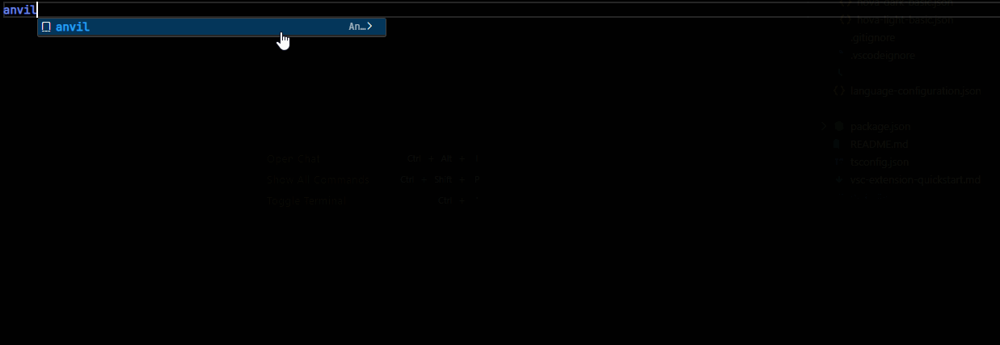

# Hova Extension — A VsCode Extension for Hova DSL

**Hova** is a declarative DSL designed for structured worldbuilding, configuration and semantic data modelings. It allows you to describe systems, entities and concepts in a human-readable, expressive and symbolic way, while still being strict enough to generate predictable structured outputs such as JSON or schema-like data.

This VSCode extension adds syntax hightlighting, hover information and tooling support to make working with **Hova** easier, clearer and more powerful.

## ✨ Features

- Syntax highlighting for `.hova`
- Keyword Hover Information
- Basic Semantic Coloring
- Snippets for common language structures

Soon:
- More Tooling
- Validation
- Advanced language support
- LSP

## 🧠 Known Issues

If you find something, open an issue on Github 👍

## 🔗 For more information

* [Hova Documentation](https://hova.space/)
* [Hova's Creator](https://gx.space)
* [Hova's Github](https://github.com/G4brielXavier/Hova)

**It's time for the Forge!**
